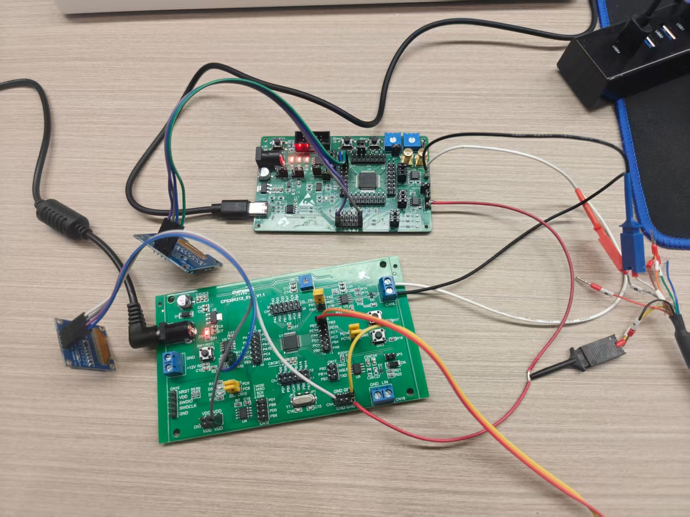

# 国产车规级 MCU 双节点 CAN 总线智能车灯控制系统
### Dual-Node Automotive CAN Lighting Control Network (CPS32K214 + YTM32B1LE0)

[](https://opensource.org/licenses/MIT)
[](https://www.chipsine.com/)
[](https://www.yuntu-semi.com/)
[]()
[]()

---

## 📌 项目概述 (Project Overview)

本项目是基于两款主流**国产车规级 MCU**（芯旺微/灿芯 **CPS32K214** 与 云途半导体 **YTM32B1LE0**）开发的**分布式汽车照明 CAN 总线协同控制系统**。

系统按照标准车规级通信规范（DBC）定义，实现中央车身控制模块（BCM / 上位机）与左、右车灯 ECU 之间的实时交互，并具备完整的 **车规级灯光优先级仲裁（Priority Arbitration）**、**位置灯抑制（Suppression）**、**双屏实时仪表状态显示** 以及 **工业级抗死锁与总线自愈保护机制**。



---

## 🏗️ 系统架构与拓扑 (System Topology)

```text
                       CAN 总线 (CAN_H / CAN_L @ 500 kbps)
     ========================================================================
         |                                 |                             |
         | (120Ω 终端电阻)                  | (总线监控 / 中央控制)         | (120Ω 终端电阻)
  +---------------+                 +---------------+             +---------------+
  |  左车灯 ECU    |                 |   BCM 上位机   |             |  右车灯 ECU    |
  | (CPS32K214)   |                 | (Toomoss/PCAN)|             | (YTM32B1LE0)  |
  +---------------+                 +---------------+             +---------------+
  | - PC6: 左转向灯 |                 | 周期/事件广播: |             | - PTD7: 右转向灯|
  | - PC5: 左位置灯 |                 |  0x100        |             | - PTD6: 右位置灯|
  | - 0.96" OLED  |                 | (BCM_Lamp_Cmd)|             | - 1.3" OLED   |
  | - SW2/SW3 拨杆|                 +---------------+             | - SW1 拨杆    |
  | 反馈: 0x201   |                                               | 反馈: 0x202   |
  +---------------+                                               +---------------+
```

---

## 🚘 车规级核心功能与亮点 (Key Features)

### 1. AUTOSAR 级车灯优先级仲裁 (Priority Arbitration)
* **转向灯优先于位置灯**：当开启转向灯（左转/右转/双闪）时，灯光系统进入高优先级模式，转向灯以 **1Hz 频率严格闪烁（500ms 亮 / 500ms 灭）**。
* **位置灯抑制机制 (Position Light Suppression)**：依据汽车安全法规，为防止同侧常亮的位置灯干扰转向指示识别，转向灯闪烁期间**强制熄灭本侧位置灯**；转向灯关闭后，位置灯**自动无缝复原常亮**。
* **危险警报闪光（双闪 Hazard Warning）**：左右两节点支持一键同步双闪。

### 2. 双控模式 (Dual Control Modes)
* **BCM 远程网络控制**：上位机（图莫斯/PCAN/CANoe）广播 `0x100`（BCM_Lamp_Cmd），对全车灯光集中控制。
* **本地独立拨杆控制**：脱离上位机时，可通过两块开发板板载按键模拟汽车转向拨杆与灯光旋钮，离线自主运行。

### 3. 双显示屏实时仪表 (Dual Dashboard Display)
* **左节点 (CPS32K214)**：配备 0.96 寸 I2C OLED (SSD1306)，实时显示接收到的转向/位置指令、当前生效物理灯光以及 100ms 报文计数。
* **右节点 (YTM32B1LE0)**：配备 1.3 寸 I2C OLED (SH1106)，同样呈现当前灯控状态、转向动态指示与总线帧率。

### 4. 工业级抗死锁与总线自愈保护 (Fault-Tolerant & Self-Healing)
* **CAN 邮箱悬挂防死锁**：集成 `TPA`（Transmit Primary Abort）硬件超时强行中止释放机制，即使拔掉总线或出现无 ACK 异常，也绝不挂起主发送邮箱。
* **I2C 超时与自动恢复**：底层绑定毫秒级硬件定时器时基，消除任何死循环隐患；通信故障时自动发送 STOP 序列复位 I2C 控制器。
* **行块传输优化**：OLED 刷屏采用单次整行 128 字节连续块传输，较传统单字符刷新减少 **98%** 的 I2C 启停事务，极大消除总线争用。

---

## 📡 通信协议与 DBC 矩阵 (CAN Matrix)

* **波特率**：500 kbps
* **帧格式**：标准帧 (11-bit ID), CAN 2.0A

### 报文列表 (Message List)

| 报文名称 | CAN ID | 发送节点 | 周期 | DLC | 核心信号定义 |
| :--- | :--- | :--- | :--- | :--- | :--- |
| **`BCM_Lamp_Cmd`** | **`0x100`** | BCM (上位机) | 100ms / 变化触发 | 8 | `TurnLight_Cmd` (0-关, 1-左转, 2-右转, 3-双闪)<br>`PosLight_Cmd` (0-关, 1-开)<br>`Rolling_Counter` (0~15) |
| **`LeftLamp_Status`** | **`0x201`** | 左车灯 (CPS32K) | 100ms 周期 | 8 | `Left_Turn_Status` (0-关, 1-亮, 2-灭, 3-故障)<br>`Left_Pos_Status` (0-关, 1-开)<br>`Left_Active_Lamp` (0-无, 1-位置灯, 2-转向灯)<br>`Left_Rolling_Counter` (0~15) |
| **`RightLamp_Status`**| **`0x202`** | 右车灯 (YTM32) | 100ms 周期 | 8 | `Right_Turn_Status` (0-关, 1-亮, 2-灭, 3-故障)<br>`Right_Pos_Status` (0-关, 1-开)<br>`Right_Active_Lamp` (0-无, 1-位置灯, 2-转向灯)<br>`Right_Rolling_Counter` (0~15) |

> 完整 DBC 配置文件位于 [`03-DBC/`](03-DBC/) 目录，提供 GBK 中文版与 EN 英文版。

---

## 🔌 硬件引脚分配与接线指南 (Pinout & Wiring)

### 1. 节点 1：左车灯 ECU (CPS32K214)

| 功能类别 | MCU 引脚 | 外部连接 / 说明 |
| :--- | :--- | :--- |
| **CAN0_RX** | `PB0` | 连接板载/外置 CAN 收发器 RXD |
| **CAN0_TX** | `PB1` | 连接板载/外置 CAN 收发器 TXD |
| **CAN0_STB**| `PA7` | 收发器使能控制（低电平正常使能） |
| **OLED SCL** | `PA11` | 0.96" OLED SCL (I2C0, 开漏上拉) |
| **OLED SDA** | `PA10` | 0.96" OLED SDA (I2C0, 开漏上拉) |
| **左转向灯** | `PC6` | 外部 LED / 示波器（高电平点亮，1Hz闪烁） |
| **左位置灯** | `PC5` | 外部 LED / 示波器（高电平点亮，常亮） |
| **SW2 按键** | `PC14` | 转向拨杆模拟（循环切换：关 -> 左转 -> 双闪 -> 关） |
| **SW3 按键** | `PC15` | 车灯旋钮模拟（切换位置灯开/关） |
| **串口调试** | `PB3(TX) / PB2(RX)` | 波特率 115200 8N1，调试信息输出 |

### 2. 节点 2：右车灯 ECU (YTM32B1LE0)

| 功能类别 | MCU 引脚 | 外部连接 / 说明 |
| :--- | :--- | :--- |
| **FlexCAN RX**| `PTA1` | CAN 收发器 RXD |
| **FlexCAN TX**| `PTA0` | CAN 收发器 TXD |
| **CAN_STB**   | `PTB4` | CAN 收发器待机控制（低电平使能） |
| **OLED SCL**  | `PTA7` | 1.3" OLED SCL (I2C0, 开漏上拉) |
| **OLED SDA**  | `PTA6` | 1.3" OLED SDA (I2C0, 开漏上拉) |
| **右转向灯**  | `PTD7` | 外部 LED（高电平点亮，1Hz闪烁） |
| **右位置灯**  | `PTD6` | 外部 LED（高电平点亮，常亮） |
| **SW1 按键**  | `PTA4` | 转向拨杆模拟（循环切换：关 -> 右转 -> 双闪 -> 关） |
| **串口调试**  | `PTB0(TX) / PTB1(RX)` | 波特率 115200 8N1，调试信息输出 |

### 3. CAN 物理总线连接规范
* 所有节点的 `CAN_H` 相互并联，所有节点的 `CAN_L` 相互并联，所有节点的 `GND` 共地连接。
* **终端电阻**：总线两端各配置一个 **120Ω 终端电阻**（断电状态下测量 CAN_H 与 CAN_L 间总电阻应在 **60Ω 左右**）。

---

## 📂 仓库目录结构 (Repository Structure)

```text
CPS-YTM-CAN/
├── 01-L-CPS/               # 芯旺微 CPS32K214 左车灯节点完整工程
│   └── CPS32K212_Demo/     # CMake + Ninja 工程源码
│       ├── App/            # 车灯应用逻辑、CAN/I2C/OLED 驱动
│       ├── build/          # 包含已编译生成的 CPS32K212_Demo.hex 固件
│       └── Driver/         # CPS 车规级外设标准库与 QuarkTS 内核
├── 02-R-YTM/               # 云途 YTM32B1LE0 右车灯节点完整工程
│   └── CAN-I2C/            # YTM 配置工具生成的 CMake 工程
│       ├── app/            # 右车灯控制逻辑与 1.3" OLED 驱动
│       ├── build/          # 包含已编译生成的 Flexcan_Demo.hex 固件
│       └── board/          # 引脚配置与 FlexCAN/I2C 外设驱动
├── 03-DBC/                 # 汽车照明网络标准 DBC 协议文件
│   ├── Vehicle_Lighting_System.dbc     # GBK 编码（兼容国内上位机软件）
│   └── Vehicle_Lighting_System_EN.dbc  # UTF-8 编码
├── 04-Hardware_Wiring.jpg  # 实物接线与测试台架图
├── .gitignore              # Git 过滤规则（排除中间 .obj/.ninja，保留 hex）
└── README.md               # 项目主说明文档
```

---

## 🚀 快速测试验证 (Quick Start)

### 1. 一键烧录固件
免除搭建交叉编译工具链的复杂流程，仓库已附带优化编译好的 Release 固件：
* **左灯固件 (CPS32K214)**：[`01-L-CPS/CPS32K212_Demo/build/CPS32K212_Demo.hex`](01-L-CPS/CPS32K212_Demo/build/CPS32K212_Demo.hex)
* **右灯固件 (YTM32B1LE0)**：[`02-R-YTM/CAN-I2C/build/Flexcan_Demo.hex`](02-R-YTM/CAN-I2C/build/Flexcan_Demo.hex)

### 2. 使用图莫斯 (Toomoss) / PCAN 上位机发送指令验证

设置 CAN 波特率为 **500 kbps**，以标准帧发送 `0x100`：

| 测试场景 | 发送 ID | 数据 (Data) | 预期灯光与屏幕效果 |
| :--- | :--- | :--- | :--- |
| **全车关灯** | `0x100` | `00 00 00 00 00 00 00 00` | 左右灯全部熄灭，屏幕显示 `[ALL LAMPS OFF]` |
| **左转向灯** | `0x100` | `01 00 00 00 00 00 00 00` | CPS 左转向灯 1Hz 闪烁，右灯灭 |
| **右转向灯** | `0x100` | `02 00 00 00 00 00 00 00` | YTM 右转向灯 1Hz 闪烁，左灯灭 |
| **危险双闪** | `0x100` | `03 00 00 00 00 00 00 00` | 左右两节点转向灯同步 1Hz 闪烁 |
| **全车位置灯** | `0x100` | `04 00 00 00 00 00 00 00` | 左右节点位置灯同时常亮，显示 `[POS LIGHT ON]` |
| **优先级抑制测试** | `0x100` | `05 00 00 00 00 00 00 00` | 左灯开位置灯+左转向：位置灯自动熄灭让位，转向灯闪烁 |

---

## 📜 开源协议 (License)

本项目遵循 [MIT License](LICENSE) 协议，欢迎用于汽车电子教学、学习研究与二次开发。
